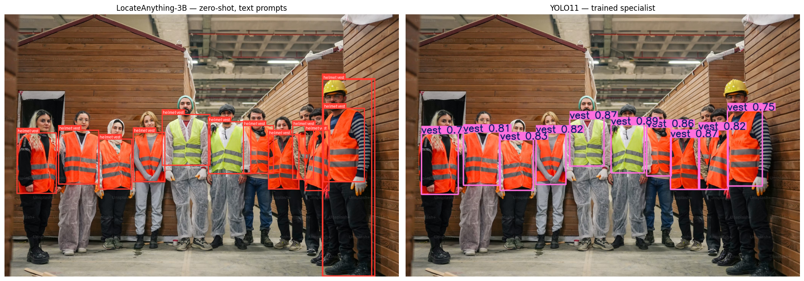
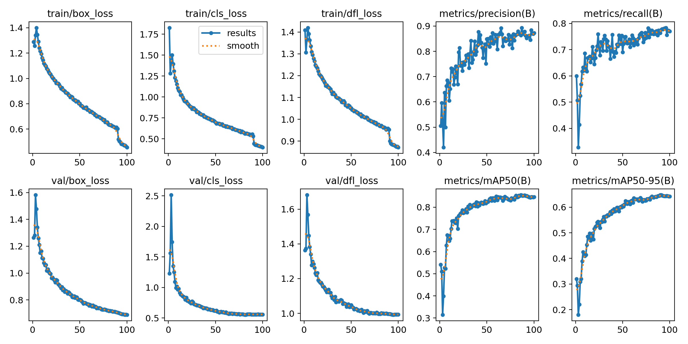
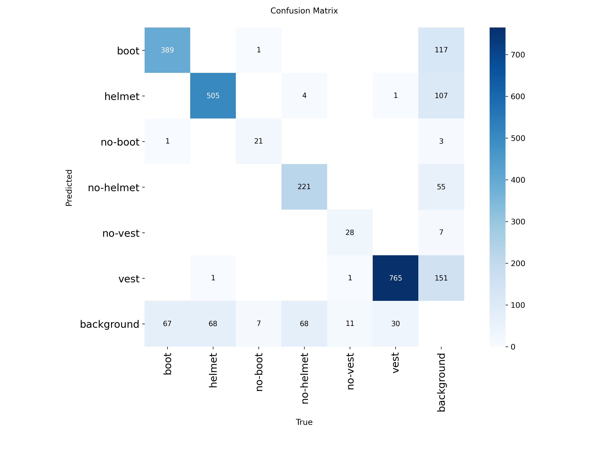
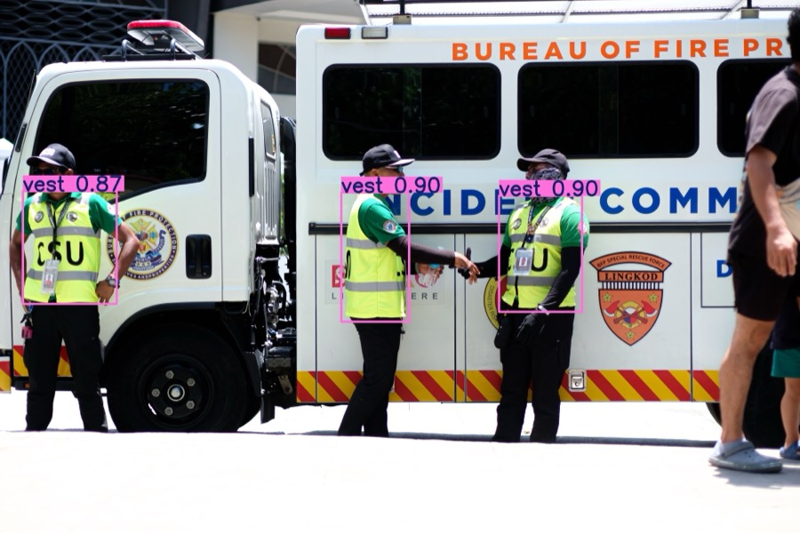
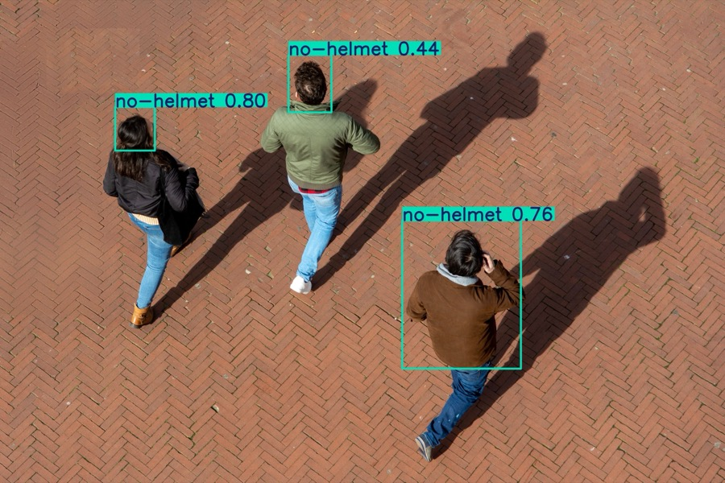
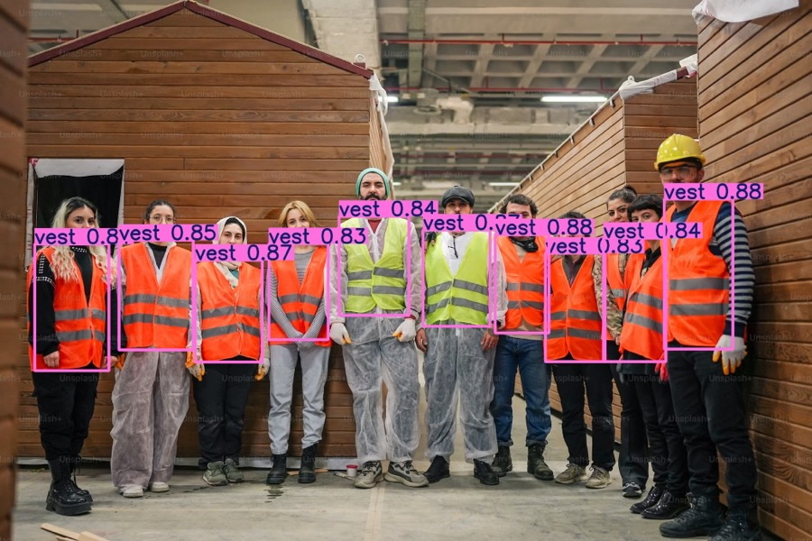
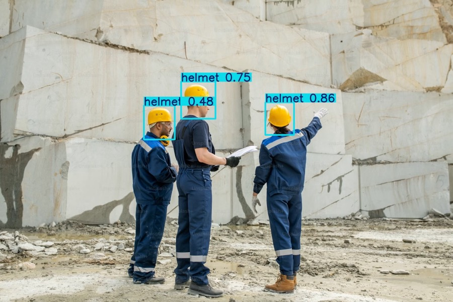
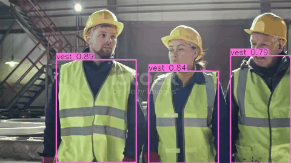
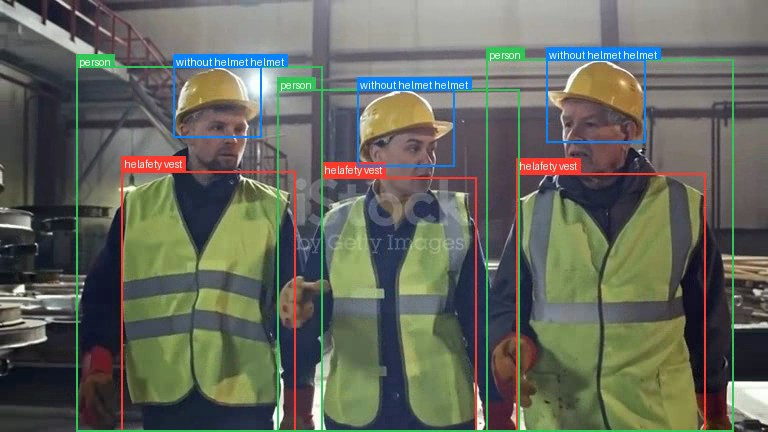
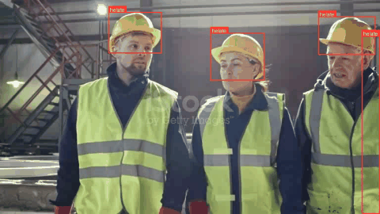

# Mining Safety and PPE Detection



*The same site photo through two detectors: NVIDIA LocateAnything-3B (zero-shot, left) and a trained
YOLO11 (right). This project builds and compares both for automatic PPE compliance checking on
mining and construction sites.*

## Introduction

The aim of this project is to build a computer-vision system that automatically checks whether
workers on mining and construction sites are wearing the required Personal Protective Equipment
(PPE). Missing a hard hat or a hi-vis vest is a leading cause of preventable site injuries, and
manual monitoring of CCTV is slow and error-prone. An object-detection model is trained from a
pretrained backbone on a labelled site-safety dataset, then extended with a rule-based layer that
turns raw detections into a **per-worker compliance verdict** (COMPLIANT / NON-COMPLIANT). The
final system runs on both still images and video, locally on a laptop GPU.

Two complementary **deep-learning** approaches are built and compared. The first is a **trained
specialist**, YOLO11 fine-tuned on the PPE dataset; *specialist* meaning it is an expert on one
fixed set of six classes and can detect nothing outside them. The second is a **zero-shot
generalist**, NVIDIA's recently released LocateAnything-3B, an open-vocabulary model that detects
*any* object described in plain text and needs no training, but is a jack-of-all-trades rather than
an expert. Building, training, evaluating, and comparing the two gives a concrete understanding of
object detection, class imbalance, and the trade-off between a precise fixed-class detector and a
flexible prompt-driven one.

## Background

PPE detection is a **computer-vision** task, solved here with **deep learning**. An **object
detector** looks at an image and returns, for every object it finds, a bounding box and a class
label with a confidence score. This project uses **YOLO11** (Ultralytics), a modern single-stage
detector built on a **convolutional neural network (CNN)** that predicts all boxes in one forward
pass, which makes it fast enough for video. Unlike a plain image classifier, and unlike older
hand-crafted vision methods, the CNN backbone *learns its own visual features* directly from
pixels, so there is no manual feature engineering.

The model is trained to recognise six PPE-related classes:

`boot`, `helmet`, `no-boot`, `no-helmet`, `no-vest`, `vest`

The three "violation" classes (`no-helmet`, `no-vest`, `no-boot`) are the ones that matter for
safety, but they are also **far rarer** in the data than the compliant classes. This class
imbalance is the central technical challenge of the project: a model can score well overall while
still missing the rare violations that are the whole point of the system. Per-class **recall** on
the violation classes is therefore the metric watched most closely.

A contrasting approach is an **open-vocabulary detector**. **LocateAnything-3B**, recently released
by NVIDIA, is a 3-billion-parameter vision-language model: instead of a fixed list of trained
classes, it takes **plain-text prompts** ("helmet", "safety vest", "person without helmet") and
returns boxes for them with **no training at all**. Its "Parallel Box Decoding" emits a whole box
in a single step, which makes it roughly 10x faster than other generative vision-language models,
though, as a 3-billion-parameter network, it is still far slower than a compact CNN detector like
YOLO11. Comparing the two sets a *zero-shot generalist* next to a *trained specialist* and exposes
exactly what each is good for.

## Method

### Data

Training uses the [CV-CBI Mining-Safety dataset](https://universe.roboflow.com/naba-zptk9/cv-cbi-mining-safety-qwvmk)
from Roboflow (~9,900 labelled images of site workers). Three preprocessing steps were applied
before training:

1. **Removed the noisy `undefined` class.** The raw export contained a 7th `undefined` class that
   scored mAP50 around 0.24 and dragged the whole model down; its labels were stripped and the
   remaining class indices remapped, leaving **6 clean classes**.
2. **Created a real validation split.** The export shipped only `train` and `test`, with
   validation pointing at the test set, i.e. the model would be selected on the same data it is
   reported on. A fixed-seed **10 %** validation split was carved out of `train`, keeping `test`
   completely held out for the final number.
3. **Resized to 768 px** to give small objects (boots, distant gear) more pixels.

### Model 1: Trained specialist (YOLO11)

The detector is a **YOLO11m** network initialised from COCO-pretrained weights and fine-tuned on
the PPE data. Key settings:

| Component | Setting |
|-----------|---------|
| Architecture | YOLO11m (medium), ~20.0 M parameters, single-stage CNN detector |
| Input / classes | 768x768, 6 classes |
| Training | 100 epochs, batch 32, optimiser `auto` (SGD), early-stopping patience 25 |
| Augmentation | mosaic 1.0, mixup 0.15, copy-paste 0.3, h-flip 0.5, HSV jitter |

Augmentation (especially `copy_paste`) was used deliberately to **up-sample the rare violation
classes** on a fixed dataset.

### Compliance layer

Because the dataset has no `person` class, the rule-based layer (`compliance_rules.py`) groups
the detected PPE boxes into "workers" by horizontal overlap: a worker is a vertical stack of
helmet (top), vest (middle), boots (bottom). For each worker it decides per-item status and rolls
it up: any detected violation class makes the worker **NON-COMPLIANT**; otherwise, judging only the
PPE that is actually visible in frame, it is **COMPLIANT**. This is the output-level "feature engineering"
that turns a detector into a usable safety check.

The full training pipeline is in `mining_ppe_yolo11.ipynb` (run top-to-bottom on a Colab GPU).
Local inference uses `predict.py` (detection) and `compliance_rules.py` (compliance) on the
exported `best.pt`.

### Model 2: Zero-shot generalist (LocateAnything-3B)

As a contrasting baseline, the same test images and a test video were run through NVIDIA
**LocateAnything-3B** with **no training**. The pipeline (in `ppe_locateanything_nvidia.ipynb`)
prompts the model with plain-language PPE terms (`helmet`, `safety vest`, `boots`,
`person without helmet`, `safety cone`, `fire extinguisher`) and parses its text output
(`<ref>label</ref><box><x1><y1><x2><y2></box>`, coordinates normalised to 0-1000) back into
boxes. Practical engineering details that mattered:

- **Resolution cap.** The vision encoder uses full self-attention over image patches, so memory
  grows with the *square* of the resolution; a full-size phone photo OOMs even an 80 GB A100.
  Images are downscaled to a 1024 px long side before inference.
- **EXIF orientation.** Phone photos carry a rotation tag that raw PIL ignores; applying it keeps
  boxes aligned (YOLO does this automatically).
- **Noise filtering.** The model occasionally emits full-frame `<0><0><1000><1000>` boxes and
  multiple boxes per label; the parser keeps every real box but drops the degenerate ones.
- **Hardware.** Needs an Ampere/Lovelace GPU (L4 / A100); about 1-3 s per frame, so video is
  processed by **frame-sampling**, not in real time. License is NVIDIA *non-commercial / research only*.

## Results

### Training

Training was stable and converged cleanly. Box, classification, and DFL losses fall smoothly on
both train and validation splits, while precision, recall, and mAP rise and then **plateau around
epoch 60-90**, so most learning happens in the first half and extra epochs give little gain.



*Fig. 1. Training and validation loss curves and metrics over 100 epochs. Validation mAP50
plateaus at around 0.85.*

### Detection accuracy (YOLO11)

On the **held-out test set** (1,979 images), the tuned model reaches:

| Metric | Value |
|--------|-------|
| mAP50 | **0.774** |
| mAP50-95 | 0.574 |
| Precision | 0.82 |
| Recall | 0.69 |

Per-class results show exactly where the model is strong and where it struggles:

| Class | mAP50 | Recall | |
|-------|-------|--------|--|
| vest | 0.94 | 0.97 | excellent |
| helmet | 0.87 | 0.75 | strong |
| boot | 0.84 | 0.66 | good |
| no-helmet | 0.79 | 0.68 | moderate |
| no-boot | 0.63 | 0.55 | weak |
| no-vest | 0.58 | 0.55 | weak |

The common compliant classes (vest, helmet) are detected very reliably; the rare violation
classes have the lowest recall, the expected consequence of class imbalance.



*Fig. 2. Validation confusion matrix. The diagonal is strong and class-to-class confusion is
tiny (helmet vs no-helmet only 4). Almost all error sits in the `background` row/column (missed
detections and false positives), not in confusing one PPE type for another.*

A key, reassuring finding from the confusion matrix: the model **rarely mislabels `helmet` as
`no-helmet`** (or vice-versa). For a safety system this is the most dangerous kind of error, and
it almost never happens. Most mistakes are instead missed detections (true objects predicted as
`background`) and false positives on background, the latter partly caused by missing labels in
the dataset (clearly-visible PPE that was never annotated).

### Inference on unseen data (YOLO11)

The model and compliance layer were run on unseen images and video. Detections on held-out
images:

| | |
|---|---|
|  |  |
| Workers in hi-vis vests, **compliant** | Bare-headed workers flagged **`no-helmet`** |
|  |  |
| 10 vests detected in a single crowded frame | Hard hats detected (`helmet`) |

*Fig. 3. Example detections on unseen images, including a correctly-flagged missing-helmet
violation (top-right).*

**Video inference** runs frame-by-frame (about 25 ms/frame on an Apple-Silicon GPU):



*Fig. 4. YOLO11 video inference demo (`video_1`).*

Across 8 test videos the compliance layer correctly passed clean scenes and flagged violations,
most strikingly a clip of a crew wearing vests but **no hard hats**, where it raised
non-compliant verdicts on over 1,800 worker-frames.

### Zero-shot results (LocateAnything-3B)

With **no training**, LocateAnything correctly grounds the main PPE items from text prompts alone:
it finds `person`, `helmet`, and `safety vest` on workers, and, unlike YOLO11, can also be asked
for items the dataset never contained (`fire extinguisher`, `safety cone`) without any retraining.



*Fig. 5. LocateAnything-3B, zero-shot from text prompts on an (out-of-domain) site clip. It finds
person / helmet / safety vest with no training, but note the **contradictory `without helmet`
label on a helmeted worker** and the absence of confidence scores.*



*Fig. 6. LocateAnything-3B annotating a video by frame-sampling (about 1-3 s/frame).*

The weaknesses are equally informative. LocateAnything returns **no confidence scores**: its text
output is only labels and box coordinates, so there is no per-detection probability to threshold or
rank by (compare YOLO11's `0.87`, `0.75`, and so on). Its boxes are **looser** than the trained
model's, and the **negation prompts are unreliable**: `person without helmet` fires even on workers
who are clearly wearing a helmet (Fig. 5). It also occasionally emits whole-frame noise boxes
(filtered out in post-processing), needs a large GPU, and is far too slow for real-time video.
Because the labels are unstable and unscored, it does **not** plug cleanly into the geometric
compliance layer the way the trained detector does.

### Specialist vs. generalist

The clearest way to see the difference is to run both models on the **same** image:


*Fig. 7. The same crowded image (`test_11`) through both models. On the right, YOLO11 gives a tight
box and a confidence score for each vest (0.87, 0.82, and so on). On the left, LocateAnything finds
the same people zero-shot but with looser, overlapping boxes, repeated `helmet vest` labels, and no
scores at all.*

| Dimension | YOLO11m (trained specialist) | LocateAnything-3B (zero-shot generalist) |
|-----------|------------------------------|------------------------------------------|
| Training needed | 100 epochs on ~9,900 labelled images | **None** (zero-shot) |
| Classes | Fixed 6 PPE classes | **Any text prompt** (open-vocabulary) |
| Measured accuracy | **mAP50 0.774** on held-out test | Not measurable here; qualitatively looser / noisier |
| Confidence scores | Yes, per box | **No** |
| Speed | ~25 ms/frame, real-time video | ~1-3 s/frame, frame-sampled only |
| Hardware | Laptop GPU / T4 | Needs L4 / A100; OOMs at full resolution |
| Novel items (extinguisher, ladder) | Cannot (not in training set) | **Yes**, with no retraining |
| Violation / negation classes | Learned, reliable `helmet`/`no-helmet` separation | Prompt-based, **contradictory / unreliable** |
| Compliance layer | Integrates cleanly (stable classes + scores) | Hard to integrate (no scores, unstable labels) |
| License | Open (Ultralytics) | NVIDIA non-commercial / research only |

*Table 1. The trained specialist wins on accuracy, speed, scores, and clean compliance
integration on its fixed classes; the generalist wins on flexibility and on catching items the
training set never contained.*

## Discussion

The results show that a single fine-tuned YOLO11 detector, plus a lightweight geometric rule
layer, is enough for reliable and controllable PPE compliance checking on site imagery. Standard
practice (a pretrained backbone, strong augmentation, a proper held-out split, and Drive
checkpointing) gave smooth, stable training and a respectable **mAP50 around 0.77** on completely
unseen data.

The head-to-head with LocateAnything-3B shows *why* the trained model is the right tool for this
job. The generalist is useful: it grounds helmets and vests from a text prompt with zero training
and can be re-pointed at new hazards in seconds. But for a **safety** system its drawbacks are
serious: no confidence scores to threshold, looser boxes, unreliable negations (the single most
safety-critical label), heavy GPU cost, and no real-time video. The specialist gives scored, stable
detections on exactly the classes that matter, which is what makes the compliance layer possible.
The practical rule: **train a specialist for the known, fixed safety classes, and use the
open-vocabulary generalist for prototyping and for flagging items that were never in the training
set.**

Three limitations remain on the trained side. **First**, recall on the rare violation classes
(`no-vest`, `no-boot`) is only around 0.55 (the model misses almost half of them), a direct result
of having ~90 examples of these versus ~9,000 vests. **Second**, the dataset itself has **label
noise**: clearly-visible helmets and boots are sometimes unannotated, which both caps the score
and shows up as "background" false positives in the confusion matrix. **Third**, confidence drops
on out-of-domain footage (clean stock/marketing video) that looks different from the mining
training images. Boots are also rarely detected in practice because feet are usually out of frame;
the compliance layer handles this by judging only the PPE that is actually visible.

## Future Research

The clearest next step is **data-centric**, not architectural: collect and label more violation
examples (`no-helmet`, `no-vest`, `no-boot`) and clean the existing labels, which is what would
move the score from around 0.77 toward 0.85+. The open-vocabulary model suggests a concrete way to
do this cheaply: use **LocateAnything to auto-propose boxes** for rare or novel items, then have a
human verify them, a fast, semi-automatic labelling loop that grows the dataset without starting
from scratch. Adding images that resemble the real deployment cameras would close the domain gap.
A cheaper, immediate gain would be a larger backbone (`yolo11l`) at higher resolution. For video,
temporal smoothing (requiring a violation across several consecutive frames) would suppress
single-frame false alarms.

## Conclusion

A YOLO11m PPE detector was trained from a pretrained backbone on a mining-safety dataset and
paired with a rule-based per-worker compliance layer. After removing a noisy class, fixing the
validation split, and tuning for the class imbalance, the model reached **mAP50 0.774** on a
held-out test set, with near-perfect separation of `helmet`/`no-helmet` and reliable detection of
the common PPE classes. Deployed locally on images and video, the full pipeline correctly
distinguishes compliant workers from violations. A zero-shot NVIDIA LocateAnything-3B baseline was
then run on the same data: it grounds PPE from text prompts with no training and can flag
unlisted items, but its lack of scores, looser boxes, and unreliable negations make the trained
specialist the better fit for a safety deployment. Beyond the working system, the project gave a
concrete understanding of object detection, the impact of class imbalance and label quality, and
the practical trade-off between a trained detector and an open-vocabulary one.

## Repository

```
mining-safety/
├── mining_ppe_yolo11.ipynb           # Train + evaluate YOLO11 (Colab GPU)
├── ppe_locateanything_nvidia.ipynb   # Zero-shot open-vocabulary baseline (NVIDIA LocateAnything-3B)
├── predict.py                        # Inference on images / folders / video (local)
├── compliance_rules.py               # Per-worker PPE compliance from detections
├── data.yaml                         # Dataset config
├── assets/                           # Figures
├── test/  train/                     # Image data
├── models/                           # Trained weights
└── result/                           # Inference outputs
```

## References

1. G. Jocher and J. Qiu, *Ultralytics YOLO11*, 2024. https://docs.ultralytics.com/models/yolo11/
2. CV-CBI Mining-Safety dataset, Roboflow Universe. https://universe.roboflow.com/naba-zptk9/cv-cbi-mining-safety-qwvmk
3. J. Redmon et al., "You Only Look Once: Unified, Real-Time Object Detection," CVPR, 2016. https://arxiv.org/abs/1506.02640
4. NVIDIA, *LocateAnything: Fast and High-Quality Vision-Language Grounding with Parallel Box Decoding*. https://huggingface.co/nvidia/LocateAnything-3B
